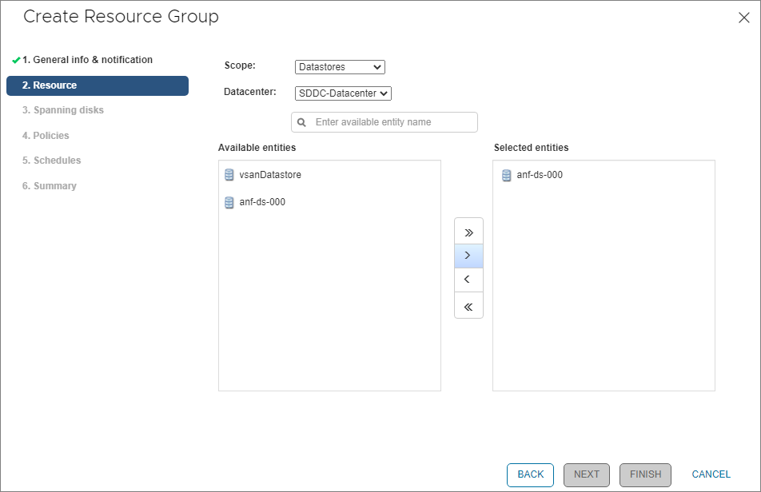
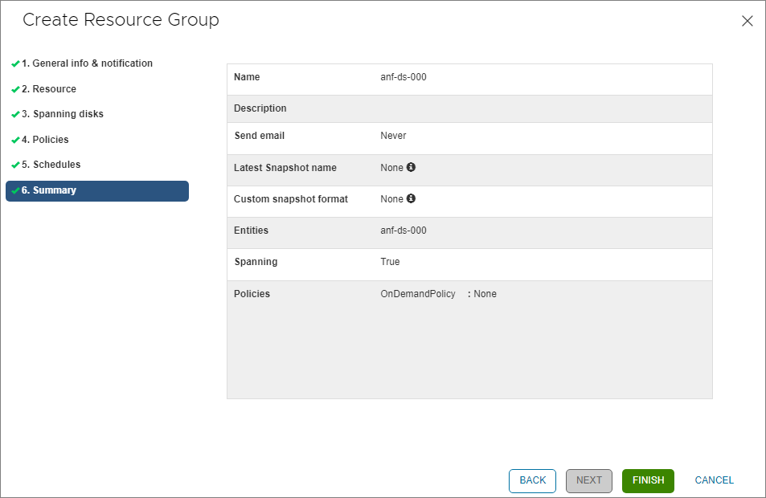

## Azure NetApp Files datastore for Azure VMware Solution (AVS) Hands-on Lab Guide

[Azure NetApp Files](https://azure.microsoft.com/services/netapp/) is an enterprise-class, high-performance, metered file storage service. The service supports the most demanding enterprise file workloads in the cloud: databases, SAP, and high-performance computing applications, with no code changes. For more information on Azure NetApp files, see the [Azure NetApp Files documentation](https://docs.microsoft.com/azure/azure-netapp-files/).

[Azure VMware Solution](https://azure.microsoft.com/services/azure-vmware/) provides you with private clouds that contain VMware vSphere clusters built from dedicated bare-metal Azure infrastructure. Azure VMware Solution supports attaching Network File System (NFS) datastores as a persistent storage option. You can create NFS datastores with Azure NetApp Files volumes and attach them to clusters of your choice. For more information on Azure VMware Solution, see the [Azure VMware Solution documentation](https://docs.microsoft.com/azure/azure-vmware/).

By using NFS datastores backed by Azure NetApp Files, you can expand your storage instead of scaling the clusters. 

Note: You can also [Attach Azure NetApp Files to Azure VMware Solution VMs](https://docs.microsoft.com/azure/azure-vmware/netapp-files-with-azure-vmware-solution) directly via NFS or SMB.

In this VMware hands-on lab, you'll begin with a provisioned Azure VMware Solution (AVS) private cloud and cluster to complete the following exercises:
1. [Create an Azure NetApp Files (ANF) volume](#create-an-azure-netapp-files-anf-volume)
2. [Attach your new ANF volume to your AVS private cloud as a datastore](#attach-your-new-anf-volume-to-your-avs-private-cloud-as-a-datastore)
3. [Migrate a running virtual machine to your new ANF datastore](#migrate-a-running-virtual-machine-to-your-new-anf-datastore)
4. [Protect your virtual machine using NetApp's Cloud Backup for Virtual Machines](#protect-your-virtual-machine-using-netapps-cloud-backup-for-virtual-machines)
5. [Restore your virtual machine using NetApp's Cloud Backup for Virtual Machines](#restore-your-virtual-machine-using-netapps-cloud-backup-for-virtual-machines)

### Create an Azure NetApp Files (ANF) volume
1. Navigate to `Azure NetApp Files` in the Azure portal

1. Select the Azure NetApp Files `NetApp account` that was assigned

1. Click on `Volumes`

1. Click on `Add volume`
    1. Basics tab
        1. For `Volume name`, use the name that was assigned
        1. For `Capacity pool`, select the capacity pool that was assigned
        1. For `Quota`, enter `1024` GiB
        1. For `Virtual network`, select the virtual network that was assigned
        1. For `Delegated subnet`, select `anf-subnet`
        1. For `Network features`, select `Standard`
        1. Click `Next: Protocol >`

    1. Protocol tab
        1. For `File path`, use the value assigned
        1. For `Versions`, select `NFSv3`
        1. Select the `Azure VMware Solution DataStore` check box
        1. Click `Review + create`
        1. Click `Create`

### Attach your new ANF volume to your AVS private cloud as a datastore
1. Navigate to `Azure VMware Solution` in the Azure portal

1. Select the `AVS Private cloud` that was assigned

1. Click `Storage (preview)`

1. Click `Connect Azure NetApp Files volume`
    1. For `NetApp account`, select the NetApp account that was assigned
    1. For `Capacity pool`, select the capacity pool that was assigned
    1. For `Volume`, select the Azure NetApp Files volume you created in the previous step
    1. For `Client cluster`, select `Cluster-1`
    1. For `Datastore name`, use the datastore name that was assigned
    1. Click `Connect`

1. Navigate back to `Azure VMware Solution` in the Azure portal

1. Select the `AVS Private cloud` that was assigned

1. Click `Storage (preview)`
1. Verify your new Azure NetApp Files datastore

### Migrate a running virtual machine to your new ANF datastore
1. Launch the vSphere Client and login using the address and credentials provided

1. Right-click on your virtual machine and select `Migrate...` from the context menu

1. Within the `Migrate` dialog window, select `Change storage only`

1. Click `Next`
1. On the next page, confirm `Batch Configure` is selected, change the `VM Storage Policy` to `Datastore Default`, and select the ANF datastore you created in the previous step

1. Click `Next`
1. Click `Finish`
1. You can monitor the progress of the migration using the `Recents Tasks` pane at the bottom of your screen.
1. Once the migration is complete, select the `Datastores` tab from your virtual machine's information pane to confirm your virtual machine is now on your ANF datastore.

### Protect your virtual machine using NetApp's Cloud Backup for Virtual Machines
Now that your virtual machine is stored on an Azure NetApp Files datastore, we can use NetApp's Cloud Backup for Virtual Machines to create a snapshot-based backup that will be virtual machine consistent.
1. Click on the hamburger menu in the top left corner and select `Cloud Backup for Virtual Machines`

1. Click `Resource Groups`
1. Click `+ Create`

1. Give your Resource Group the same name as the datastore you created in the previous step

1. Click `Next`
1. Find your datastore in the list on the left and click the single arrow pointing to the right

1. Click `Next`
1. In the `Spanning disks` pane, leave the first/default option selected

1. Click `Next`
1. In the `Policies` pane, select `OnDemandPolicy`

1. Click `Next`
1. In the `Schedules` pane, leave everything as is

1. Click `Next`
1. Review the `Summary` and click `Finish`
1. Click `OK`

1. You should now see your Resource Group listed (you may need to click the refresh button within the vSphere client)

1. Select/highlight your Resource Group
1. Click `Run Now`
1. Click `OK` to dismiss the pop-up

1. Click `Dashboard` to view the `Recent Job Activites` and verify your backup was successful, you may need to wait a minute and refresh the vSphere client.
 
You have now created an Azure NetApp Files snapshot that is 'virtual machine consistent' using NetApp's Cloud Backupfor Virtual Machines
### Restore your virtual machine using NetApp's Cloud Backup for Virtual Machines
Once your virtual machine has been deleted, you can restore it using NetApp's Cloud Backup for Virtual Machines
1. From the vSphere client, navigate back to your Inventory

1. Select `Datastores`
1. Select your datastore from the list on the left
1. Click the `Configure` tab

1. Click `Backups` under the `Cloud Backup for Virtual Machines` sub-heading
1. Select your backup from the list

1. Highlight your virtual machine in the list
1. Click the `Restore` button

1. In the `Restore` dialog window, check the `Restart VM` checkbox and leave the `Restore Location` set to `Original Location`
1. Click `Next`

1. In the `Select location` pane, confirm that your ANF datastore is selected
1. Click `Next`

1. Review the `Summary` and click `Finish`

1. Click `OK` in the `Restore` warning pop-up window
 
1. You can view the status of the restore process in the `Recent Tasks` pane at the bottom of the window.
1. Once the restore is complete, navigate back to the vSphere Inventory and confirm your virtual machine is running.
