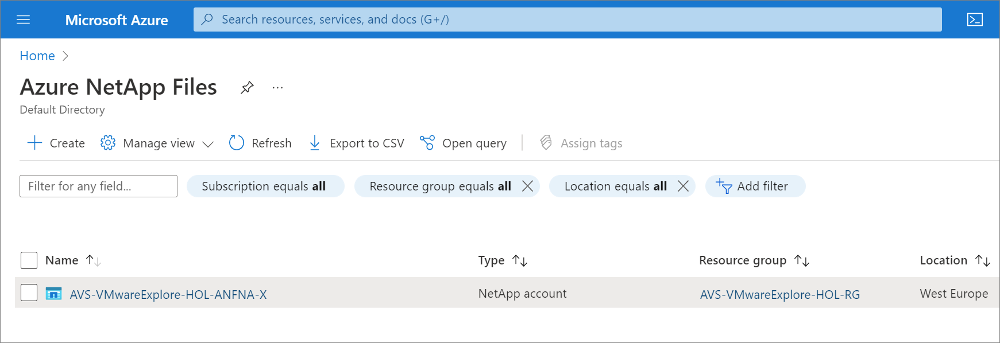

## Azure NetApp Files datastore for Azure VMware Solution (AVS) Hands-on Lab Guide

[Azure NetApp Files](https://azure.microsoft.com/services/netapp/) is an enterprise-class, high-performance, metered file storage service. The service supports the most demanding enterprise file workloads in the cloud: databases, SAP, and high-performance computing applications, with no code changes. For more information on Azure NetApp files, see the [Azure NetApp Files documentation](https://docs.microsoft.com/azure/azure-netapp-files/).

[Azure VMware Solution](https://azure.microsoft.com/services/azure-vmware/) provides you with private clouds that contain VMware vSphere clusters built from dedicated bare-metal Azure infrastructure. Azure VMware Solution supports attaching Network File System (NFS) datastores as a persistent storage option. You can create NFS datastores with Azure NetApp Files volumes and attach them to clusters of your choice. For more information on Azure VMware Solution, see the [Azure VMware Solution documentation](https://docs.microsoft.com/azure/azure-vmware/).

By using NFS datastores backed by Azure NetApp Files, you can expand your storage instead of scaling the clusters. 

Note: You can also [Attach Azure NetApp Files to Azure VMware Solution VMs](https://docs.microsoft.com/azure/azure-vmware/netapp-files-with-azure-vmware-solution) directly via NFS or SMB.

In this VMware hands-on lab, you'll begin with a provisioned Azure VMware Solution (AVS) private cloud and cluster to complete the following exercises:
1. [Create an Azure NetApp Files (ANF) volume](#create-an-azure-netapp-files-anf-volume)
2. [Attach your new ANF volume to your AVS private cloud as a datastore](#attach-your-new-anf-volume-to-your-avs-private-cloud-as-a-datastore)
3. [Migrate a running virtual machine to your new ANF datastore](#migrate-a-running-virtual-machine-to-your-new-anf-datastore)
4. [Protect your virtual machine using NetApp's Cloud Backup Service for Virtual Machines (CBS for VMs)](#protect-your-virtual-machine-using-netapps-cloud-backup-service-for-virtual-machines-cbs-for-vms))
5. [Restore your virtual machine using NetApp's CBS for VMs](#restore-your-virtual-machine-using-netapps-cbs-for-vms)

### Create an Azure NetApp Files (ANF) volume
1. Navigate to `Azure NetApp Files` in the Azure portal

1. Select the Azure NetApp Files `NetApp account` that was assigned to you

1. Click on `Volumes`

1. Click on `Add volume`
    1. Basics tab
        1. For `Volume name`, use the name that was assigned to you
        1. For `Capacity pool`, select the capacity pool that was assigned to you
        1. For `Quota`, enter `1024` GiB
        1. For `Virtual network`, select the virtual network that was assigned to you
        1. For `Delegated subnet`, select `anf-subnet`
        1. For `Network features`, select `Standard`
        1. Click `Next: Protocol >`

    1. Protocol tab
        1. For `File path`, use the value assigned to you
        1. For `Versions`, select `NFSv3`
        1. Select the `Azure VMware Solution DataStore` check box
        1. Click `Review + create`
        1. Click `Create`

### Attach your new ANF volume to your AVS private cloud as a datastore
1. Navigate to `Azure VMware Solution` in the Azure portal

1. Select the `AVS Private cloud` that was assigned to you

1. Click `Storage (preview)`

1. Click `Connect Azure NetApp Files volume`
    1. For `NetApp account`, select the NetApp account that was assigned
    1. For `Capacity pool`, select the capacity pool that was assigned
    1. For `Volume`, select the Azure NetApp Files volume you created in the previous step
    1. For `Client cluster`, select `Cluster-1`
    1. For `Datastore name`, use the datastore name that was assigned
    1. Click `Connect`

1. Navigate back to `Azure VMware Solution` in the Azure portal

1. Select the `AVS Private cloud` that was assigned to you

1. Click `Storage (preview)`
1. Verify your new Azure NetApp Files datastore

### Migrate a running virtual machine to your new ANF datastore

### Protect your virtual machine using NetApp's Cloud Backup Service for Virtual Machines (CBS for VMs)

### Restore your virtual machine using NetApp's CBS for VMs